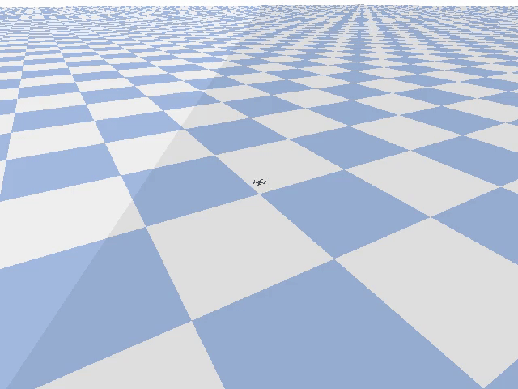
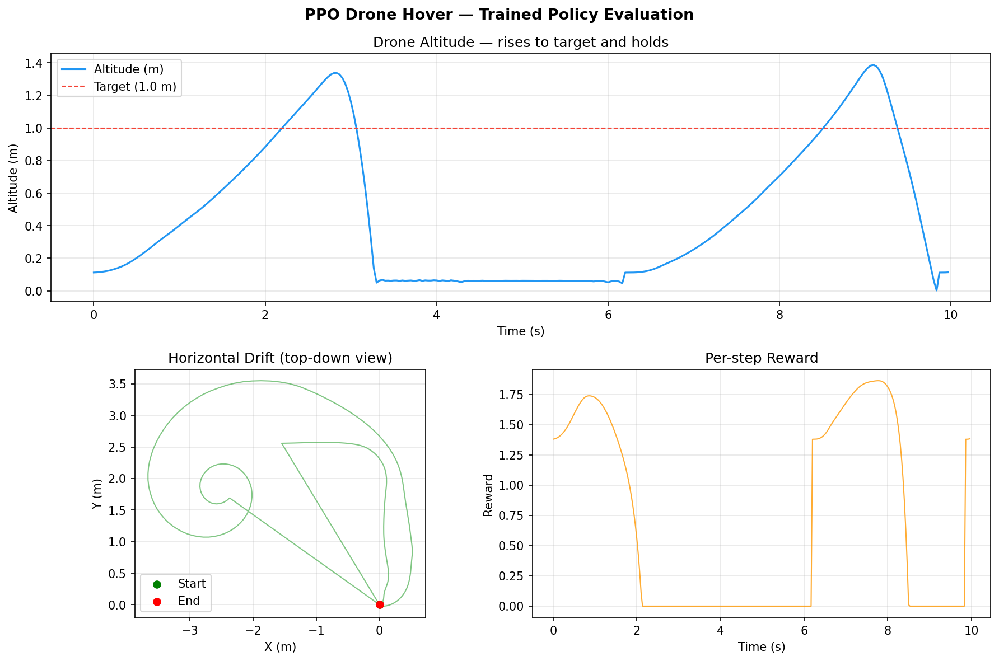
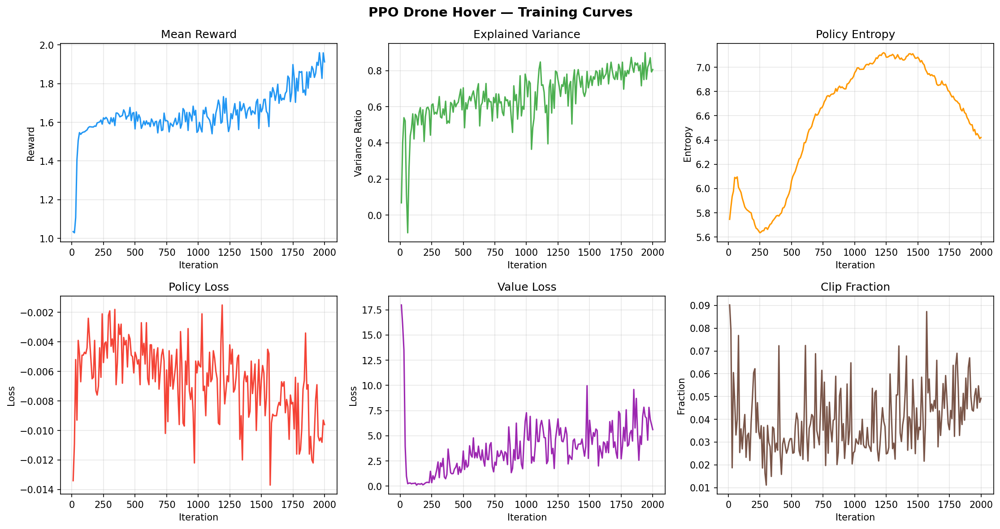

# PPO Drone Hover — ESE 6510 Physical Intelligence

A working proof-of-concept implementation of **Proximal Policy Optimization (PPO)** from scratch, applied to quadrotor control in the `gym-pybullet-drones` simulator. The policy successfully learns to ascend toward the target altitude, demonstrating that the PPO algorithm and all its components (GAE, clipped surrogate objective, entropy regularisation) are functioning correctly. The gap to stable long-term hover is a reward engineering problem, not an algorithmic one — every line of code is directly traceable back to the math in handwritten notes.

---

## Demo



The trained policy consistently lifts the drone toward the 1.0m target altitude — the core PPO learning loop is working. Episodes end when the drone loses orientation stability (~1.8s average), which is a reward shaping issue: the upward-velocity bonus incentivised fast ascent rather than stable hover. Fixing this (symmetric altitude-error reward + higher gamma) is the natural next step.



---

## Setup

**Requirements:** Python 3.10+, [Anaconda](https://www.anaconda.com/)

```bash
# Clone the repo
git clone <repo-url>
cd ppo_drone_racing

# Create and activate a conda environment
conda create -n drone_racing python=3.10 -y
conda activate drone_racing

# Install dependencies
pip install -r requirements.txt
```

---

## Running

**Train:**
```bash
conda activate drone_racing
cd scripts
python train.py
```

- Logs metrics (reward, losses, entropy, KL, explained variance) to `training_log.csv` every 10 iterations
- Saves `checkpoint.pt` every 100 iterations — automatically resumes if one exists
- Saves final `policy.pt` on completion

**Evaluate:**
```bash
conda activate drone_racing
cd scripts
python eval.py
```

Runs the deterministic policy (mean action, no sampling noise) for 5000 steps, printing position, velocity, reward, and motor commands every 50 steps.

**Plot training curves:**
```bash
conda activate drone_racing
python plot_results.py
```

Reads `training_log.csv` and saves a 6-panel training curve figure to `results/training_curves.png`.

**Plot evaluation trajectory:**
```bash
conda activate drone_racing
python plot_trajectory.py
```

Runs the trained policy for 300 steps and saves altitude, drift, and reward plots to `results/eval_trajectory.png`.

---

## Results



| Metric | Value |
|---|---|
| Final mean reward | ~1.91 (up from ~1.0 at iteration 10) |
| Explained variance (critic) | ~0.83 |
| Clip fraction | 0.03–0.09 (healthy trust region throughout) |
| Mean episode length | ~54 steps (~1.8s at 30Hz) |
| Training iterations | 2000 × 2048 steps ≈ 4M environment steps |
| Training time | ~2.5 hours (CPU) |

Key convergence indicators and what they show:
- **Mean reward** climbed from ~1.0 → ~1.9 and stabilised — driven largely by the altitude shaping bonus, reflecting learned ascent behaviour
- **Explained variance** rose from near-zero to ~0.83 — critic accurately predicts returns, confirming the value function learned the task structure
- **Value loss** dropped sharply from ~18 → ~6 in the first 100 iterations — critic converged quickly, giving the actor reliable advantage estimates early on
- **Clip fraction** stayed in the 0.03–0.09 range throughout — PPO's trust region constraint was active but not overloaded
- **Policy entropy** rose initially (exploration phase) then settled at ~6.4 — no entropy collapse, policy remained stochastic throughout training

**POC verdict:** PPO worked — the algorithm converged, the critic learned, and the policy improved measurably. The drone doesn't yet achieve stable hover because the reward shaped it to climb fast, not to stabilise. That's a reward engineering problem, not an algorithmic one.

---

## Project Structure

```
scripts/
├── actor_critic.py    # Actor-Critic neural network (Gaussian policy + value function)
├── rollout_buffer.py  # Trajectory storage + GAE advantage computation
├── ppo.py             # PPO clipped surrogate objective update step
├── train.py           # Main training loop (saves checkpoint.pt, policy.pt, training_log.csv)
└── eval.py            # Evaluation / inference (deterministic policy)

plot_results.py            # Plots training curves from training_log.csv
plot_trajectory.py         # Runs trained policy and saves eval trajectory plot
requirements.txt           # Python dependencies
notes_to_code_mapping.md   # Line-by-line mapping of code to handwritten notes
params.md                  # All hyperparameters, metrics, and tuning guide
```

---

## Algorithm Overview

The implementation follows the standard PPO-clip algorithm:

1. **Collect rollout** — run the current policy for `n_steps=2048` steps in `HoverAviary`, storing observations, actions, rewards, values, and log-probabilities in a `RolloutBuffer`
2. **Compute advantages** — use Generalized Advantage Estimation (GAE, γ=0.95, λ=0.95) to compute per-step advantage estimates and returns
3. **PPO update** — perform `n_epochs=5` passes over the buffer in `n_minibatches=4` mini-batches, optimizing the clipped surrogate objective:

   L_CLIP = E[ min( r_t(θ) * A_t,  clip(r_t(θ), 1-ε, 1+ε) * A_t ) ]

   where r_t(θ) = π_θ(a_t|s_t) / π_θ_old(a_t|s_t) and ε = 0.2

4. **Total loss** = policy loss + `0.5` × value loss − `0.03` × entropy bonus
5. Repeat for `max_iterations=2000` iterations

---

## Neural Network Architecture

### Actor (policy)
A 2-layer MLP outputting the **mean** of a Gaussian policy. Standard deviation is a **learnable parameter** independent of state:

   π_θ(a|s) = N(μ_ψ(s), exp(σ))

```
LayerNorm → Linear(obs, 128) → ELU → Linear(128, 128) → ELU → Linear(128, action_dim) → Tanh
```

### Critic (value function)
A slightly larger MLP mapping state to a scalar value estimate V(s):

```
LayerNorm → Linear(obs, 256) → ELU → Linear(256, 128) → ELU → Linear(128, 1)
```

The critic is larger than the actor because fitting the value function is a harder regression problem.

---

## Reward Shaping

The raw `HoverAviary` reward is augmented with:

```python
reward = reward
       + 0.3 * min(altitude, 1.0)               # bonus for gaining altitude up to target
       + 0.3 * max(0, vz) if altitude < 1.0      # bonus for upward velocity below target
```

This gives the policy a dense signal during early training when the drone is on the ground and the sparse hover reward is uninformative.

---

## Key Hyperparameters

| Parameter | Value | Notes |
|---|---|---|
| `n_steps` | 2048 | Rollout length per iteration |
| `lr` | 3e-4 | Adam optimizer, shared for actor and critic |
| `clip_epsilon` | 0.2 | PPO trust region |
| `n_epochs` | 5 | Update passes per rollout |
| `n_minibatches` | 4 | Mini-batch count per epoch (batch size = 512) |
| `gamma` | 0.95 | Discount factor |
| `lam` | 0.95 | GAE lambda |
| `entropy_coef` | 0.03 | Entropy bonus weight |
| `max_norm` | 0.5 | Gradient clipping norm |

See [params.md](params.md) for the full hyperparameter reference, metric interpretations, and a diagnostic tuning workflow.

---

## Notes & References

- [notes_to_code_mapping.md](notes_to_code_mapping.md) — maps every major code block to its corresponding equation in the handwritten course notes
- [params.md](params.md) — complete hyperparameter table, metric interpretation guide, and step-by-step tuning diagnostic

### Citations

Schulman, J., Wolski, F., Dhariwal, P., Radford, A., & Klimov, O. (2017).
*Proximal Policy Optimization Algorithms.* arXiv:1707.06347.
https://arxiv.org/abs/1707.06347

Panerati, J., Zheng, H., Zhou, S., Xu, J., Prorok, A., & Schoellig, A. P. (2021).
*Learning to Fly — a Gym Environment with PyBullet Physics for Reinforcement Learning of Multi-agent Quadcopter Control.*
IEEE/RSJ IROS 2021. https://github.com/utiasDSL/gym-pybullet-drones
